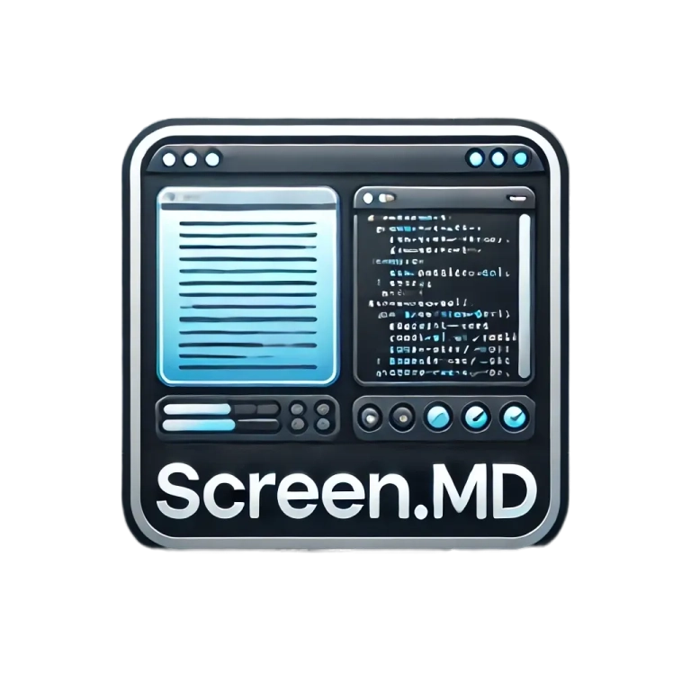

<div align="center">

# Screen.md


A beautiful, terminal-based Markdown editor and previewer for distraction-free writing

[](LICENSE)
[](https://golang.org/)
[](#status)

[Features](#✨-features) • [Installation](#💿-installation) • [Usage](#📖-usage) • [Contributing](#🤝-contributing)


</div>

## ✨ Features

- 📏 **Split-view Interface** - Edit and preview simultaneously
- 🎨 **Real-time Rendering** - See your changes as you type
- 🌈 **Syntax Highlighting** - Beautiful code presentation
- ⚡ **Lightweight & Fast** - Built with Go for optimal performance
- 📱 **Terminal-native** - Works where you work

## 🚧 Status

Screen.md is currently in **alpha**. While core features are functional, expect changes and improvements as development continues.

## 💿 Installation

### Prerequisites
- Go 1.16 or higher
- Git

```bash
# Clone the repository
git clone https://github.com/tejas242/screen.md.git

# Install and run
cd screen.md
go mod tidy
go run main.go
```

## 📖 Usage

### Basic Controls
- `Tab` - Toggle between editor and preview
- `Ctrl+C` / `Esc` - Exit
- `↑/↓` - Navigate preview
- Standard text editing keys

### Getting Started
1. Launch Screen.md
2. Start writing in the left pane
3. See live preview in the right pane
4. Use Tab to switch between modes

## 🛣️ Development Roadmap

### Phase 1 - Core Features
- [x] Basic editor/preview layout
- [x] Live markdown rendering
- [x] Syntax highlighting
- [ ] File operations (save/load)
- [ ] Vim mode support

### Phase 2 - Enhanced Features
- [ ] Custom themes
- [ ] Image previews
- [ ] Configuration system
- [ ] Git integration
- [ ] LLM assistance

### Phase 3 - Advanced Features
- [ ] Multi-file support
- [ ] Search and replace
- [ ] Custom snippets
- [ ] Export options

## 🔧 Technical Stack

- [Bubble Tea](https://github.com/charmbracelet/bubbletea) - TUI framework
- [Glamour](https://github.com/charmbracelet/glamour) - Markdown rendering
- [Lipgloss](https://github.com/charmbracelet/lipgloss) - Styling
- [Chroma](https://github.com/alecthomas/chroma) - Syntax highlighting

## 🤝 Contributing

While Screen.md is currently a personal project, feedback and suggestions are welcome:

1. 🐛 [Report bugs](https://github.com/tejas242/screen.md/issues)
2. 💡 [Suggest features](https://github.com/tejas242/screen.md/issues)
3. 📝 [Submit pull requests](https://github.com/tejas242/screen.md/pulls)

## 💭 Personal Note

Screen.md emerged from my need for a simple yet powerful terminal-based markdown editor. It's designed to enhance the writing experience while maintaining the efficiency of terminal-based workflows.

## 📸 Screenshots

*Coming soon - The application is still in early development*

## 📄 License

Screen.md is open-source software licensed under the [MIT license](LICENSE).

---

<div align="center">
Made with ❤️ by <a href="https://github.com/tejas242">Tejas</a>
</div>
